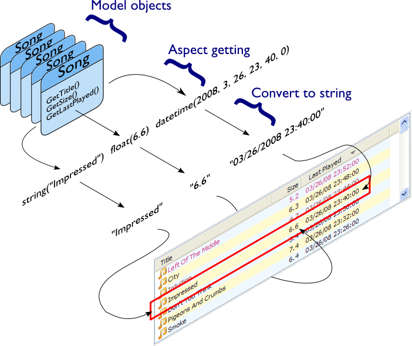
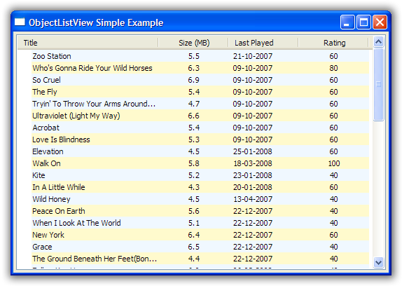
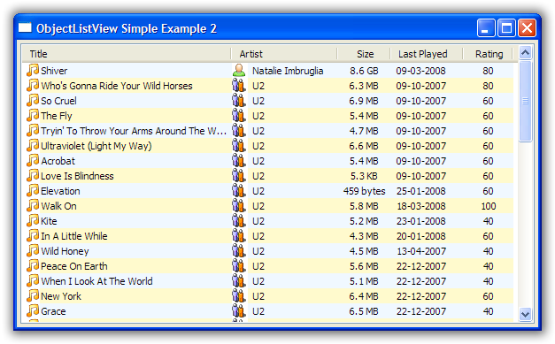

.. -*- coding: UTF-8 -*-

.. _getting-started-label:

Getting Started
===============

Introduction
------------

I often find that I have a collection of objects which I want to present to the
user in some sort of tabular format. It could be the list of clients for a
business, a list of known FTP servers or even something as mundane as a list of
files in a directory. User interface-wise, the ListCtrl is the
perfect control for these situations. However, I find myself groaning at the
thought of using the ListCtrl and secretly hoping that I can use a
ListBox instead.

The reason for wanting to avoid the ListCtrl is all the
boilerplate code it needs to work. There is the basic "list building loop"
insert the data item, add the subitems, call SetItemData() with some integer that
will tell me which data object the row is showing.

If I want to allow sorting, I can either write everything from scratch (again), or I
can do the work of setting up the 'itemDataMap' so that ColumnSorterMixin will work.

When the user right clicks on the list, I have to figure out which rows are selected,
and then maps those rows back into the model objects I am interested in. Neither of these
tasks are obvious if you don't already know the tricks.

The ObjectListView was designed to take away all these repetitive tasks and so
make a ListCtrl much easier to use.

Mental gear shift
-----------------

.. admonition:: This is important. You need to understand this.
    :class: singleLineCallout

    ignored

Before you start trying to use an ObjectListView, you should understand that the process
of using one is different to the process of using a normal ListCtrl. A normal ListCtrl is
essentially passive: it sits there, and you poke and prod it and eventually it shows
you want. An ObjectListView is much more active. You tell it what you want done and the
ObjectListView does it for you.

An ObjectListView is used declaratively: you state what you want the ObjectListView to do
(via its configuration), then you give it your collection of model objects, and the
ObjectListView does the work of building the ListCtrl for you.

This is a different approach to using a ListCtrl. You must get your mind around this,
especially if you have done any ListCtrl programming before (See :ref:`unlearn`).

The crucial part of using an ObjectListView is configuring it. Some of this configuration
is done on the ObjectListView itself. However, most of this configuration
can be done on the columns that are used within the list. Within each column definition,
you say what the column should be called, what data it should show, and how that data
is to be formatted (there is more, but that's enough to start with).

Once the columns and control are configured, putting it into action is simple. You give it
the list of model objects you want it to display, and the ObjectListView will build the
ListCtrl for you::

    self.myFirstOlv.SetObjects(myListOfTracks)

.. _unlearn:

Unlearn you must
----------------

.. admonition:: This section is for those who are familiar with using a ListCtrl.
    :class: singleLineCallout

    ignored

For those of you who have struggled with a ListCtrl before, you must unlearn. An
ObjectListView is not a drop in replacement for a ListCtrl. If you have an existing
project, you cannot simply create an ObjectListView instead of creating a ListCtrl. An
ObjectListView needs a different mindset. If you can perform the mind-mangling step of
changing your thinking, ObjectListView will be your best friend.

If you find yourself inserting rows, changing subitems, or calling SetItem() or
its friends, you need to stop - you are being seduced to the dark side. An
ObjectListView does all that work for you. You tell it the aspects of each model
object you want to show (via the ColumnDefn objects), specify any formatting
and then you give it the list of objects to show.

Resist the temptation to add, edit, remove, or otherwise mess with the rows of
an ObjectListView -- it will not work.

There is also no need to hide information in each row. Old style ListCtrl
programming often required attaching a key of some sort to each row, so that when
the user did something with a row, the programmer would know which model object that row
was related to. This attaching was often done by creating one or more zero-width columns,
or by calling SetItemData() with some integer that uniquely identified the model object.

With an ObjectListView , you do not need to do this anymore. The ObjectListView already
knows which model object is behind each row. In many cases, the programmer simply uses the
`GetSelectedObjects` method to find out which model objects the user wants to do something
to.

This bit goes here, that bit goes there
---------------------------------------

The first configuration step is to tell each column which bit (called an "aspect") of your
model object it is going to display. This is done through the column's `valueGetter` attribute.

In the most common case, the `valueGetter` attribute of the column is the name of the
attribute that the column should display.

Imagine that we were writting an application that managed a MP3 music library. A central part
of this application would be the list of tracks available in the library. Your central model class,
Track, might look like this::

    class Track(object):

        def __init__(self, title, artist, album, lastPlayed, sizeInBytes, rating):
            self.title = title
            self.artist = artist
            self.album = album
            self.lastPlayed = lastPlayed
            self.sizeInBytes = sizeInBytes
            self.rating = rating

        def GetSizeInMb(self):
            return self.sizeInBytes / (1024.0*1024.0)

To show the title in a column, you would make a ColumnDefn like this::

    titleColumn = ColumnDefn("Title", "left", 120, "title")

This says, "Make a left-aligned column, 120 pixels wide, with a title 'Title',
which shows the aspect 'title' from each model object."

The definitions for the artist and the album are similar::

    artistColumn = ColumnDefn("Artist", "left", 120, "artist")
    albumColumn = ColumnDefn("Album", "left", 120, "album")

Converting to strings
---------------------

OK, we've told our first few columns which bits of data they should display. For the
title, artist, and album columns, this is all that is necessary. But for the "Size In MBs"
and "Last Played" columns, there is something else we need to consider: how to convert our
bit of data to a string.

A ListCtrl control can only display strings. Everything else - booleans,
integers, dates, whatever - has to be converted to a string before it can be
given to the ListCtrl. By default, the ObjectListView converts data to strings
using the string format operation, more or less like this: ``"%s" % aspectValue``

You can use a different format string (instead of the default "%s") by setting
the `stringConverter` attribute on the column definition. If the
`stringConverter` attribute isn't ``None``, its value will be used as the format
string instead of "%s".

So for our "Size In MBs" column, we are only interested in one decimal places, so
we would define that column like this::

    sizeInMbColumn = ColumnDefn("Size (MB)", "center", 100,
                                "GetSizeInMb", stringConverter="%.1f")

Notice that here we used a method name ("GetSizeInMb") instead of an attribute name.
The column definition can handle either (actually, it can handle quite a bit more than
that, but that's for later).

If the aspectValue is a date or time, then instead of using the plain `%`
operator, the `stringConverter` is used as the parameter to ``strftime``
method, like this: ``dateTimeAspect.strftime(column.stringConverter)``

So, we would configure our "Last Played" column like this::

    lastPlayedColumn = ColumnDefn("Last Played", "left", 100,
                                  "lastPlayed", stringConverter="%d-%m-%Y")

Can't you draw me a picture to explain this?
--------------------------------------------

You can visualise this process like this:

Put it all together and what have you got?
------------------------------------------

Putting all these columns together, we put them into use via the `SetColumns` method::

    self.myFirstOlv.SetColumns([
        ColumnDefn("Title", "left", 120, "title"),
        ColumnDefn("Size (MB)", "center", 100, "GetSizeInMb", stringConverter="%.1f"),
        ColumnDefn("Last Played", "left", 100, "lastPlayed", stringConverter="%d-%m-%Y"),
        ColumnDefn("Rating", "center", 100, "rating")
    ])

[I dropped the Artist and Album columns so that the screen shot below is smaller].

Once we have defined the columns, we set the whole thing into action with `SetObjects`::

   self.myFirstOlv.SetObjects(self.listOfTracks);

And we should get something like this:

What have we achieved?
----------------------

Underwhelmed? Admittedly, it's not much to look at, but be patient. Also,
consider how much work you had to do to make it happen: some column definitions
and one line of code. It doesn't look so bad now, does it?

With those column definitions, we have a ListCtrl that shows the title, date
last played, size (in megabytes) and rating of various tracks in your music
library. But, actually, we have quite a bit more than that.

Without any extra work, sorting just works. Clicking on the column headers will
sort and reverse sort the rows. The sort is accurate for the data type: when
sorting by size, a song of 35 megabytes will come after a song of 9 megabytes.

The control also understands 'model object' level operations. So, we can ask the
control for the tracks that are selected (via the `GetSelectedObjects` method).
We can refresh the information about
one or more tracks (using `RefreshObjects` method)

We also have the access to some of the nice builtin functions that ObjectListView provides.

Adding some images
------------------

OK, that's good, but any real ListCtrl needs to be able to put little icons next to the
text. That is our next task.

A ListCtrl can only ever show images that exist in its image list. To make an image
available to an ObjectListView, you call `AddImages` method::

    musicImage = self.myOlv.AddImages(Images.getMusic16Bitmap(), Images.getMusic32Bitmap())

This registers two versions of the same image to the `ObjectListView`. The second bitmap is
only used when the list is in Large Icon view. If your control is never going to be put
into Large Icon view (for example, it's always in Details view), you don't need to register
the second image.

The `AddImages` method return an integer that identifies the image. Referring to images
via their index is a bit of a pain. It's easier to register named images, via
`AddNamedImages` and then use the names of the images::

    self.myOlv.AddNamedImages("user", Images.getUser16Bitmap(), Images.getUser32Bitmap())
    self.myOlv.AddNamedImages("group", Images.getGroup16Bitmap(), Images.getGroup32Bitmap())

Once we have an image registered, we can use it in the control. This is done using the
`imageGetter` attribute of a column. When a column wants to determine what image should
be shown, it uses the `imageGetter` attribute. The simplest case is to assign a constant
to this attribute. This will give every cell in the column the same image, like this::

    titleColumn = ColumnDefn("Title", "left", 120, "title", imageGetter=musicImage)

This is easy, but limited. Much more useful is giving a callable as the `imageGetter`
(notice that here we're using image names)::

    def artistImageGetter(track):
        soloArtists = ["Nelly Furtado", "Missy Higgins", "Moby", "Natalie Imbruglia",
                       "Dido", "Paul Simon", "Bruce Cockburn"]
        if track.artist in soloArtists:
            return "user"
        else:
            return "group"

    artistColumn = ColumnDefn("Artist", "left", 120, "artist", imageGetter=artistImageGetter)

If the `imageGetter` is a callable, it must accept a single parameter, which is the model
object whose image is being sought. It should return the name or the index of the image to
display, or -1 if no image should be shown.

The `imageGetter` can also be given the name of an attribute or a method of your model
object. This is useful when the model objects themselves know which image they should use.

Smarter string conversions
--------------------------

Being able to change the `stringConverter` to a different format string is useful, but there
are just some cases that need something more substantial.

In our Track class, the actual size of the track is stored as `sizeInBytes`. It would be
nice if we could show the size as "360 bytes", "901 KB", or "1.1 GB" which ever was more
appropriate.

To do this, we can set the `stringConverter` attribute to be a callable, like this::

    def sizeToNiceString(byteCount):
        for (cutoff, label) in [(1024*1024*1024, "GB"), (1024*1024, "MB"), (1024, "KB")]:
            if byteCount >= cutoff:
                return "%.1f %s" % (byteCount * 1.0 / cutoff, label)
        if byteCount == 1:
            return "1 byte"
        else:
            return "%d bytes" % byteCount

    sizeColumn = ColumnDefn("Size", "center", 100, "sizeInBytes", stringConverter=sizeToNiceString)

If `stringConverter` is a callable, it must accept a single parameter, which is the value to be
converted (note: it's the value not the model object that is given to the converter).

Putting all these bits together, we now have something that looks like this:

Hey! That's starting to not look too bad.

And they're off and running
---------------------------

Well done! You've made it to the end of the tutorial. You should by now have a reasonable
grasp of some of the things an ObjectListView can do, and how to use it in your
application.

If you need further help, you can look at the :ref:`Cookbook <cookbook-label>` and the `Forum
<https://sourceforge.net/forum/forum.php?forum_id=825500>`_ for those questions
that just don't have answer anywhere else.

Don't forget: Use The Source Luke! You have all the source code. If you can't figure
something out, read the code and see what is actually happening.
