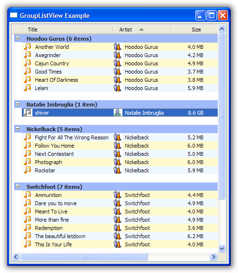

.. -*- coding: UTF-8 -*-

.. _using-grouplistview:

Using a GroupListView
=====================

A flat list is enough in many cases, but sometimes it would be really nice to be able to
put the model objects into groups, making it easier for users to see where something belongs.
It's nice that our database of songs can be sorted by "Album," but it would be even nicer if
the control was able to put all the tracks for an album together under their own title.

This is what a `GroupListView` does. And it looks like this:

Understanding the process
-------------------------

To make a GroupListView work, the control needs to collect the model objects
into different groups. This is done in the following steps:

1. Calculate a "group key" for each object.
2. All objects with the same group key are placed into the same group.
3. The group key is converted into a string, which become the title of the group.

Understanding this simple
process is the key to working with a `GroupListView`. Remember this, and you will have
conquered the `GroupListView`.

Getting the "group key"
-----------------------

The "group key" for an object is normally whatever value the object has in the "group by"
column. So if list of tracks is being grouped by the "Artist" column, the group key for a
track will be, for example, "Coldplay" or "Nickelback".

However, that isn't always the best group key. For example, without any other
configuration, if we group our tracks by the "Last Played" column, every track ends up in
it's own group (bonus points if you can explain why).

If we want the tracks to be more usefully grouped, we will need to install a group key getter
for the "Last Played" column. In this case, we want all tracks that were played in the same month
to be placed into the same group. So for each track, we want to calculate the month it was last played
and return that as the group key.

We would do this by creating a function and then installing it as the group key getter for the column::

    def lastPlayedGroupKey(track):
        # We only want to group tracks by the month in which they were played
        return datetime.date(track.lastPlayed.year, track.lastPlayed.month, 1)
    ...
    ColumnDefn("Last Played", "left", 100, "lastPlayed", groupKeyGetter=lastPlayedGroupKey)

The *groupKeyGetter* can be specified in the same ways that a *valueGetter* can be specified:

1. a callable that accepts the model whose group key should be calculated.
2. a string which will be treated as:
    - the name of parameter-less instance method
    - the name of an instance variable
    - an index into a dictionary-like object
3. an integer, used as an index into a indexable collection

Grouping by initial letter
^^^^^^^^^^^^^^^^^^^^^^^^^^

One common pattern is for objects to be grouped by the first letter of a string value. For example
on the "Title" column, all tracks starting with "A" would be grouped together. This is so common
that there is a built-in way to do it: set useInitialLetterForGroupKey to True for a column::

    ColumnDefn("Title", "left", 120, "title", imageGetter=musicImage, useInitialLetterForGroupKey=True)

Converting the "group key" to title
-----------------------------------

Once the group keys have been calculated for each model object, and all the model objects
with the same group key have been collected into their respective groups, we are almost
ready to present the groups to the user.

The final remaining step is to decide that to call the group. The name of a group is normally
its group key converted to a string. This works well when the group key is a string, and reasonably
well for other data types, but sometimes you need something different. In those cases, you
can install a *groupKeyConverter* on the column::

    def lastPlayedGroupKeyConverter(groupKey):
        # Convert the given group key (which is a date) into a representation string
        return groupKey.strftime("%B %Y")
    ...
    ColumnDefn("Last Played", "left", 100, "lastPlayed", groupKeyGetter=lastPlayedGroupKey,
               groupKeyConverter=lastPlayedGroupKeyConverter)

Here our group key is the first of the month in which the track was last played. Without
a *groupKeyConverter*, the title of the groups would look like "2008/05/01". But with our
*groupKeyConverter*, the title of the groups end up like "May 2008", which is nicer.

The *groupKeyConverter* operates in the same way that a *stringConverter* operates.

Using `SetGroups()` directly
----------------------------

All of the above steps are used when you give the `GroupListView` a straight list of model
objects, leaving the `GroupListView` to convert the model objects into groups. It is also
possible for the programmer to manually create the groups and then tell the GroupListView
to show the groups that the programmer has created.

Each group is represented by a `ListGroup` object. A `ListGroup` basically consists of a
title and a list of model objects that are to be shown in the groups.

Once the programmer has created a list of `ListGroup` objects, they should be given to
`SetGroups()` method. The order of the groups in the list, and the order of the model
objects in the group are the order in which they will be presented to the user.

If you manually create the groups, you will need to handle sorting yourself, or turn off
sorting altogether. This is necessary since the `GroupListView` will not know how to
recalculate the groups.

Customizing using events
------------------------

A `GroupListView` triggers several events which allow the programmer to change key
behaviours of the control.

+-------------------+-------------------------------------------------------------+
|EVT_GROUP_CREATING | Triggered when a new collection of groups has been created  |
|                   | but not yet displayed to the user. The handler of this event|
|                   | can make any changes they like to the groups, including     |
|                   | the names of the group and the members.                     |
+-------------------+-------------------------------------------------------------+
|EVT_GROUP_SORT     | Triggered when the groups need to be sorted. Both the groups|
|                   | themselves and the model objects within each group should   |
|                   | be sorted. The handler of this event should called          |
|                   | `Handled()` on the event, otherwise normal sort processing  |
|                   | will occur.                                                 |
+-------------------+-------------------------------------------------------------+
|EVT_EXPANDING      | Triggered when one or more groups is being expanded.        |
|                   | The handler of this event can call `Veto()` to prevent      |
|                   | the groups from being expanded.                             |
+-------------------+-------------------------------------------------------------+
|EVT_EXPANDED       | Triggered after one or more groups have been expanded.      |
|                   | This is a notification event only.                          |
+-------------------+-------------------------------------------------------------+
|EVT_COLLAPSING     | Triggered when one or more groups is being collapsed.       |
|                   | The handler of this event can call `Veto()` to prevent      |
|                   | the groups from being collapsed.                            |
+-------------------+-------------------------------------------------------------+
|EVT_COLLAPSED      | Triggered after one or more groups have been collapsed.     |
|                   | This is a notification event only.                          |
+-------------------+-------------------------------------------------------------+

Other capabilities
------------------

A `GroupListView` can stop showing groups and revert to a straight `ObjectListView` by
calling *SetShowGroups(False)*.
