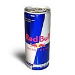
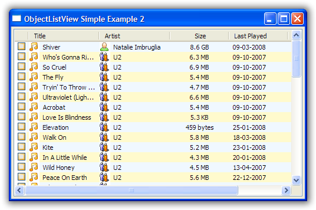
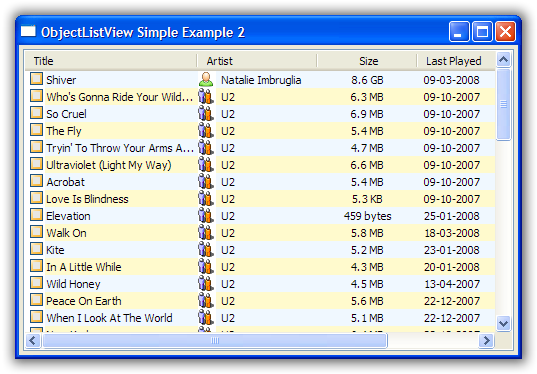

.. -*- coding: UTF-8 -*-

.. _cookbook-label:

Learning to cook
================

.. container:: recipes

    :ref:`recipe-flavour`

    :ref:`recipe-editing`

    :ref:`recipe-column-width`

    :ref:`recipe-fixed-column`

    :ref:`recipe-column-filling`

    :ref:`recipe-formatter`

    :ref:`recipe-checkbox`

    :ref:`recipe-emptymsg`

    :ref:`recipe-nonclasses`

    :ref:`recipe-partial`

    :ref:`recipe-group-format`

    :ref:`recipe-batched-updates`

.. _recipe-flavour:

1. What flavour of ObjectListView do I want to use?
---------------------------------------------------

There are three flavours of ObjectListView (four if you include `GroupListView`):

ObjectListView - Plain Vanilla
^^^^^^^^^^^^^^^^^^^^^^^^^^^^^^

*Stock standard, but still very nice*

A normal ObjectListView is capable of anything a ListCtrl can do -- only in a much
easier to use package. Though it will handle a large number of rows, it is better
suited for smaller lists, that is, about 1000 rows or less.

If in doubt, start with this flavour. You can always change it to one of the others later on.

VirtualObjectListView - Expresso
^^^^^^^^^^^^^^^^^^^^^^^^^^^^^^^^

*Has a slight bitter taste, but makes you capable of anything*

When you want to knock your users out with 10 million search results in a ListCtrl, a
VirtualObjectListView is for you. It can handle any number of objects.

But it does so at a cost:

* You have to implement your own sorting method.
* You cannot use object level commands like `SelectObject` or `RefreshObject`
  since the list has no way of knowing where any given model object is in the list.

But for the cost of this "bitterness," you really can do anything.

FastObjectListView - Red Bull
^^^^^^^^^^^^^^^^^^^^^^^^^^^^^

*Also makes you capable of anything, but without the bitterness*

When you want speed, speed, and more speed, but you don't want the bitterness of the
VirtualObjectListView, a FastObjectListView is your weapon of choice.

It operates just like a normal ObjectListView -- only much faster.

Did I mention the speed?

GroupListView
^^^^^^^^^^^^^

A `GroupListView` is slightly different type of beast. You would use this creature when
you want your users to be able to group your model objects into different "partitions" depending
on the column they last clicked.

See :ref:`using-grouplistview` for more information.

.. _recipe-editing:

2. How do I let the user edit the values shown in the list?
-----------------------------------------------------------

This really needs a page to itself: :ref:`Cell Editing in an ObjectListView <cell-editing-label>`

.. _recipe-column-width:

3. How can I stop the user from making a column too narrow or too wide?
-----------------------------------------------------------------------

Columns have both `minimumWidth` and `maximumWidth` attributes. By default, these are -1,
which means that no limit is enforced. But if they are set to some other value, the column
will be limited to the given minimum or maximum width.

For example, this::

    self.titleColumn.minimumWidth = 30

will stop the "Title" column from becoming less than 30 pixels in width. This is useful
for preventing users from shrinking columns to 0 width and then not being about to find
them again.

.. _recipe-fixed-column:

4. How can I stop the user from resizing a column?
--------------------------------------------------

There are some columns just don't make sense to be resizable. A column that always shows a
16x16 status icon makes no sense to be resizable. To make a column be fixed width and
unresizable by the user, you can create the column with a `fixedWidth` parameter::

    self.statusColumn = ColumnDefn("", imageGetter=statusImageGetter, fixedWidth=16)

Or, if you decide after column creation that the column should be fixed width,
you can call `SetColumnFixedWidth`::

    self.olv1.SetColumnFixedWidth(0, 16) # the first column is fixed to 16 pixel wide

.. _recipe-column-filling:

5. How can I make a column get bigger when the ObjectListView is made bigger?
-----------------------------------------------------------------------------

On most columns, the column's width is static, meaning that it doesn't change by itself.
But sometimes it would be useful if a column would resize itself to show more (or less) of
itself when the user changed the size of the ListCtrl. For example, the rightmost column
of a personnel list might display "Comments" about that person. When the window was made
larger, it would be nice if that column automatically expanded to show more of the
comments about that person. You can make this happen by setting the `isSpaceFilling`
attribute to ``True`` on that column.

An ObjectListView can have more than one space filling column, and they generally share
the available space equally between them (see the ``freeSpaceProportion`` attribute to change
this).

You should be aware that as the ObjectListView becomes smaller, the space filling columns
will become smaller too, until they eventually disappear (have zero width). The
`minimumWidth` and `maximumWidth` attributes still work for space filling columns. So you can
use the `minimumWidth` attribute to make sure that space filling columns don't disappear.

.. _recipe-formatter:

6. How can I change the colours of a row?
-----------------------------------------

You install a `rowFormatter` on the ObjectListView.

A rowFormatter is a callable that accepts two parameters: a wx.ListItem, and the model
object for that wx.ListItem. The rowFormatter can change the formatting of the list item,
or any of its other properties.

To show customers in red when they owe money, you could do this::

    def rowFormatter(listItem, customer):
        if customer.amountOwed > 0:
            listItem.SetTextColour(wx.RED)

    self.objectListView1.rowFormatter = rowFormatter

Due to the vaguarities of virtual lists, `rowFormatter` for a `VirtualObjectListView`
operates slightly differently. Instead of being given a wx.ListItem, it is given
a wx.ListItemAttr object. These object only support a limited subset of wx.ListItem
method, specifically those members related to the background color, text colour and
font. See wx.ListItemAttr for more details of what is supported.

.. _recipe-checkbox:

7. How do I use checkboxes in my ObjectListView?
------------------------------------------------

ObjectListView allows several ways of using check boxes. The simplest way is to call
`CreateCheckStateColumn`::

    self.objectListView1.CreateCheckStateColumn()

This creates a new column in the control that is solely for the purpose of showing a
checkbox for each row. By default, this column is the first column (you can pass an
integer to `CreateCheckStateColumn` to create the column at a different position). It
results in something that looks like this:

If you don't want to have a specific column just for the checkbox, you can use an
existing column as the check box column. To do this, call `InstallCheckStateColumn`
with the column defn you want to show the check boxes. Be aware that a column can only
have one image, so that column will have the checkbox as its image, and will ignore anything
you might have set up with the `imageGetter` attribute.

So, if we installed the "Title" column as a checkbox column::

    self.objectListView1.InstallCheckStateColumn(self.titleColumn)

It would produce something different:

Each track now has the checkbox image instead of the track image.

The user can change checkboxes by clicking on the check box (obviously) or by selecting
one or more rows and pressing Space. Pressing :kbd:`Space` toggles the values of the selected rows.
Actually, it toggles the top-most check box, and the sets all the other rows to have the
same value.

Data-based Checkboxes
^^^^^^^^^^^^^^^^^^^^^

Both of these methods install checkboxes where the "checked-ness" of the rows are specific
to that ObjectListView. So if the same model object was visible in two different lists, it
could be checked in one but not in the other.

But sometimes, the "checked-ness" of a row is part of the model object itself. Consider a
customer management system, where customers could be marked as active or not. This ``isActive``
property should be the same regardless of which listview was showing the customer.

To define that checkbox column where the data comes from the model object, you would give
that column a `checkStateGetter` attribute::

    isActiveColumn = ColumnDefn("Active?", fixedWidth=24, checkStateGetter="isActive")

Or instead of giving the checkbox its own column, you could combine the checkbox with the
customers name::

    nameColumn = ColumnDefn("Name", valueGetter="name", checkStateGetter="isActive")

Though this would stop the "Name" column from having its own image.

ObjectListViews support multiple check box columns.

.. _recipe-emptymsg:

8. How do I change the message that's shown when the ObjectListView is empty?
-----------------------------------------------------------------------------

When an ObjectListView is empty, it can display a "this list is empty" type message. You
alter the text and its font using the following methods::

	self.objectListView1.SetEmptyListMsg("This database has no rows")
	self.objectListView1.SetEmptyListMsgFont(wx.FFont(24, wx.DEFAULT, face="Tekton"))

.. _recipe-nonclasses:

9. How can I show a list of dictionaries in the ObjectListView?
---------------------------------------------------------------

    *I have a list of dictionaries that hold the data I want to show.
    How can I show them in an ObjectListView?*

In your ColumnDefn, set the ``valueGetter`` to the key of the data you want to display in that column.
Everything should just work. As a bonus, your dictionary will be automatically updated when the user
edits a cell value (if the ObjectListView is editable).

Example::

    self.listOfDictionaries = [
        { "title":"Shiver", "artist": "Natalie Imbruglia", "album":"Counting Down the Days" },
        { "title":"Who's Gonna Ride Your Wild Horses", "artist": "U2",  "album":"Achtung Baby" },
        { "title":"So Cruel", "artist": "U2",  "album":"Achtung Baby" },
        { "title":"The Fly", "artist": "U2",  "album":"Achtung Baby" }
    ]
    self.myOlv.SetColumns([
        ColumnDefn("Title", "left", -1, "title"),
        ColumnDefn("Artist", "left", -1, "artist"),
        ColumnDefn("Album", "center", -1, "album")
    ])
    self.myOlv.SetObjects(self.listOfDictionaries)

.. _recipe-partial:

10. How can I reference the column in a valueGetter function?
-------------------------------------------------------------

    *I've got a super-duper valueGetter function, but it needs to know which column
    it's being used for. How can I do that?*

Normally, valueGetter functions don't know which column they are being used for. But there
could be cases where you might want to know the column: for example, you might have a
central getter function that decides that to do based on which column is being used.

So, imagine our super valueGetter looks like this::

    def MySuperValueGetter(modelObject, columnDefn):
        # Do something clever here
        return value

There are (at least) three possible solutions:

a) Use functools.partial()::

    import functools

    for column in self.olv1.columns:
        column.valueGetter = functools.partial(MySuperValueGetter, columnDefn=column)

This only works with Python 2.5 and later.

b) Use local functions and default parameters::

    for column in self.olv1.columns:
        def myFunc(modelObject, col=column):
            return MySuperValueGetter(modelObject, col)
        column.valueGetter = myFunc

c) Subclass ColumnDefn and override GetValue()::

    class MyColumnDefn(ColumnDefn):

        def GetValue(self, modelObject):
            return MySuperValueGetter(modelObject, self)

.. _recipe-group-format:

11. How can I change the way group headers look?
------------------------------------------------

    *Whoever decided on the colour scheme for group headers was an artistic incompetent.
    I want to use my own snazzy scheme. How do I do that?*

The formatting of group headers is strictly limited. wx.ListCtrl's do not support any form
of owner drawing, so anything snazzy is currently impossible. Don't even think about trying
to do gradient fills or fancy text effects -- it's just not possible.

What you can do is:

- change the colour of the text, via the *groupTextColour* variable.

- change the colour of background of the entire row, via the *groupBackgroundColour* variable.
  You can't change just the group header background. It is the whole row or nothing.

- change the font of the header via the *groupFont* variable. Remember that row height is fixed,
  so if you make the font too big, the text will be truncated. The header row will *not* become
  bigger.

.. _recipe-batched-updates:

12. How can I only redraw the control every N seconds?
------------------------------------------------------

    *I'm writing a network monitor app. In some circumstances, the model objects can be updated
    100 times or more each second. But if I try to update the ObjectListView that often, the
    application grinds to a halt. Is there is an easy way to make the ObjectListView not redraw
    so often?*

Yes. You can use a ``BatchedUpdate`` adapter. This wraps an ObjectListView such that no
matter how often you update it, it will redraw at most once every N seconds (you supply
the value of N).

So in your network monitor app, you need to added a line like this some time after the
ObjectListView is created and before it is used::

    self.olv = ObjectListView.BatchedUpdate(self.olv, SECONDS_BETWEEN_UPDATES)

This wraps the original *olv* with an Adapter that intercepts some of the model updating commands
(``SetObjects()`` or ``AddObjects()`` or ``RefreshObjects()``) so that the control only redraws once every
SECONDS_BETWEEN_UPDATES seconds (SECONDS_BETWEEN_UPDATES is a constant defined by you somewhere else).

See Examples/BatchedUpdateExample.py for a demonstration and :ref:``here for class docs <batchedupdate-class>``.
